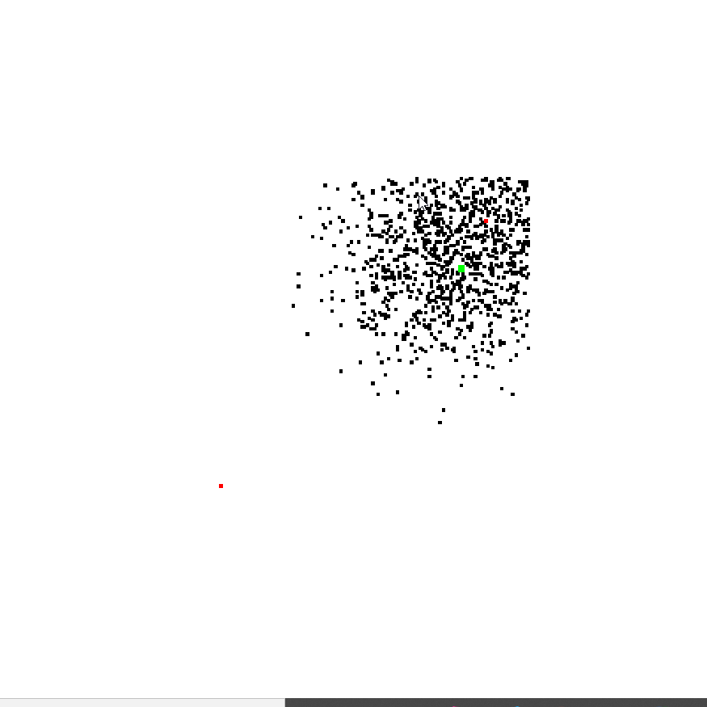

# Rust Flockers
An initial attempt at implementing the ants forage simulation, with a visualization of it as well.

# How to run
Simply run `cargo run --example antsforage_amethyst`, or add the `--release` flag for a slower to compile, faster to execute option.

# Current issues
- Obstacles are not implemented yet;
- Pheromones lack some sort of visualization;
- Pheromones do not evaporate over time.

# References:
- https://github.com/eclab/mason/tree/master/mason/src/main/java/sim/app/antsforage